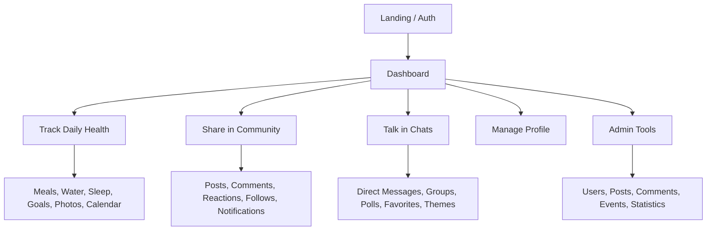

<div align="center">

# FitLife

### Laravel fitness platform with health tracking, community features, and built-in messaging.

<p>
  
  
  
  
  
</p>

<p>
  
  
  
  
</p>

<p>
  <a href="#overview">Overview</a> •
  <a href="#product-areas">Product Areas</a> •
  <a href="#stack">Stack</a> •
  <a href="#quick-start">Quick Start</a> •
  <a href="#practical-notes">Practical Notes</a> •
  <a href="#repository-shape">Repository Shape</a>
</p>

</div>

---

| Models | Migrations | Test Files | Locales |
|:------:|:----------:|:----------:|:-------:|
| 30 | 47 | 34 | 3 |

## Overview

FitLife is a Laravel 12 application that brings fitness tracking and social engagement into one product loop. Users can log meals, water, sleep, goals, progress photos, and activity calendar events, then move into community posts, profile discovery, notifications, direct messages, and group chats without leaving the same interface.

This repository already contains the core product surface rather than a thin demo. The app includes authenticated dashboards, profile management, social interactions, multilingual UI, moderation flows, and a messaging system with group roles, polls, favorites, media attachments, and themes.

## Product Areas

### Health Tracking

- meal logging with macro tracking
- USDA FoodData Central lookup with local fallback food data
- water tracking with daily intake logging
- sleep tracking with overnight duration handling
- goal management with progress logs
- progress photo uploads and personal profile metrics
- calorie calculator flow
- activity calendar entries

### Community

- post feed with media support and multiple sorting modes
- comments and comment reactions
- post reactions and post view tracking
- follower and following pages
- subscription request flow separate from follows
- profile pages and avatar management
- notifications for platform activity

### Messaging

- direct conversations gated by mutual follows
- group chats with owner, admin, and member roles
- text, image, video, file, and voice messages
- replies, edits, deletes, reactions, favorites, and pinned messages
- in-chat search and message forwarding
- chat themes for conversations and groups
- group polls with voting
- polling endpoints for refresh, history, and typing status

### Admin Surface

- admin dashboard
- user moderation and profile review
- post moderation
- comment moderation
- event moderation
- platform statistics
- super-admin-only administrator management

## Product Flow



## Stack

| Layer | Details |
|:------|:--------|
| Backend | PHP 8.2+, Laravel 12, Eloquent ORM, Blade views, Breeze auth scaffolding |
| Frontend | Vite 7, Tailwind CSS 3, Alpine.js, page-specific CSS and JS assets |
| Data | Laravel migrations, Eloquent models, local public storage, bundled SQL backup |
| Tooling | Pest 4, PHPUnit, Laravel Pint, Laravel Pail, Concurrently |
| Integration | USDA FoodData Central via `USDA_FOODDATA_CENTRAL_API_KEY` |

## Quick Start

### Requirements

- PHP 8.2+
- Composer
- Node.js and npm
- a configured database connection

### Installation

```bash
composer install
npm install
cp .env.example .env
php artisan key:generate
```

### Environment

Set the required application and database values in `.env`:

- `APP_URL`
- `DB_CONNECTION`
- `DB_HOST`
- `DB_PORT`
- `DB_DATABASE`
- `DB_USERNAME`
- `DB_PASSWORD`

Optional configuration:

- `USDA_FOODDATA_CENTRAL_API_KEY` for live nutrition search
- `AWS_ACCESS_KEY_ID`, `AWS_SECRET_ACCESS_KEY`, `AWS_DEFAULT_REGION` for non-local storage setups

### Database and Storage

```bash
php artisan migrate --seed
php artisan storage:link
```

### Local Development

Run the bundled development workflow:

```bash
composer dev
```

That script starts:

- Laravel development server
- queue listener
- Laravel Pail log stream
- Vite dev server

Manual alternative:

```bash
php artisan serve
npm run dev
```

### Build and Test

```bash
npm run build
composer test
./vendor/bin/pint
```

## Data Bootstrap Options

### Fresh Schema

```bash
php artisan migrate --seed
```

### Restore the Included SQL Dump

The project root contains `fitlife_backup.sql`.

Example restore:

```bash
mysql -u <user> -p <database_name> < fitlife_backup.sql
php artisan migrate
php artisan storage:link
```

## Testing Surface

The Pest suite covers more than framework boilerplate. Existing tests touch areas such as:

- authentication and authorization
- profile editing and admin privacy constraints
- posts, comments, reactions, and subscriptions
- dashboard, calendar, and biography flows
- food tracker, calorie calculator, water tracker, and sleep tracker
- goals and progress calculations

## Practical Notes

### Public Storage Is Required

Media uploads rely on the public disk, so `php artisan storage:link` is required for avatars, progress photos, and other user-facing uploads to resolve correctly.

### USDA Lookup Falls Back Gracefully

If `USDA_FOODDATA_CENTRAL_API_KEY` is missing, the app still works with local fallback food data. Add the API key when you want broader nutrition lookup coverage.

### Messaging Is Not WebSocket-Based

Chat refresh, history loading, and typing indicators are implemented through polling endpoints. This README intentionally avoids claiming WebSocket real-time messaging because the current codebase does not use it.

### Upload Limits Need Server Alignment

Post uploads are validated in the app with a 2 MB limit for photos and a 10 MB limit for videos. If your reverse proxy is stricter, it can still reject requests before Laravel validation runs.

### Keep the Welcome Entry in Vite

The landing page depends on `resources/css/welcome-entry.css` being present in `vite.config.js`. Removing that entry breaks production styling for the welcome screen.

## Roles and Access

| Role | Access |
|:-----|:-------|
| User | Health tracking, community, messaging, profile, notifications |
| Admin | Dashboard and moderation for users, posts, comments, events, and statistics |
| Super Admin | Everything above plus administrator management |

## Repository Shape

```text
app/
  Http/
    Controllers/
    Middleware/
    Requests/
  Models/
  Policies/
  Providers/
  View/Components/

database/
  factories/
  migrations/
  seeders/

resources/
  css/
  js/
  lang/
  views/

routes/
  web.php
  auth.php
  admin.php

tests/
  Feature/
  Unit/
```

## Key Application Areas

- `routes/web.php` contains the main product routes.
- `routes/admin.php` contains admin and super-admin access flows.
- `app/Http/Controllers` contains the tracking, social, messaging, and moderation workflows.
- `app/Models` contains the domain entities behind health logs, social objects, and chat features.
- `resources/views` contains the Blade UI for trackers, profiles, posts, conversations, groups, notifications, and admin pages.
- `resources/lang` contains English, Russian, and Latvian translation files.

---

<div align="center">

Built for a product where personal progress and social momentum live in the same interface.

</div>